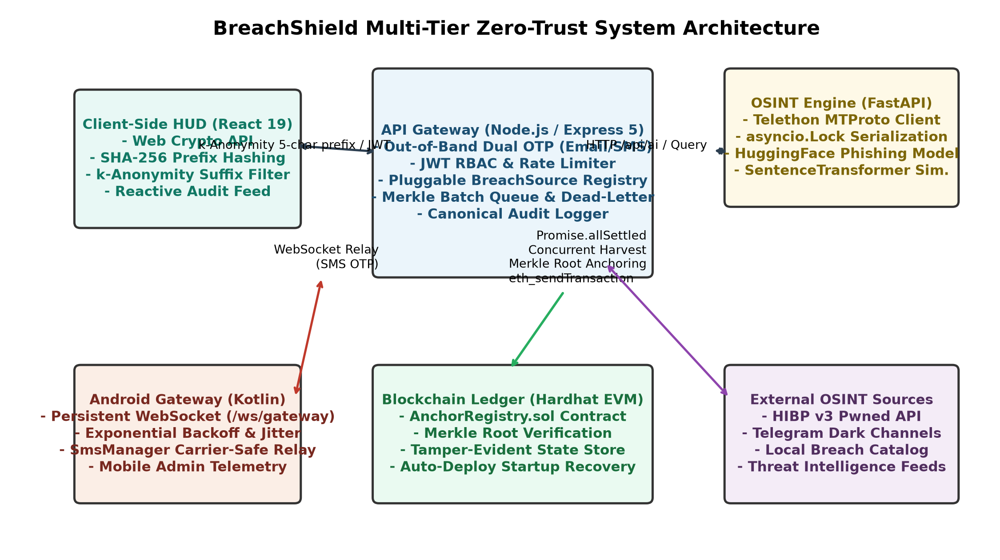
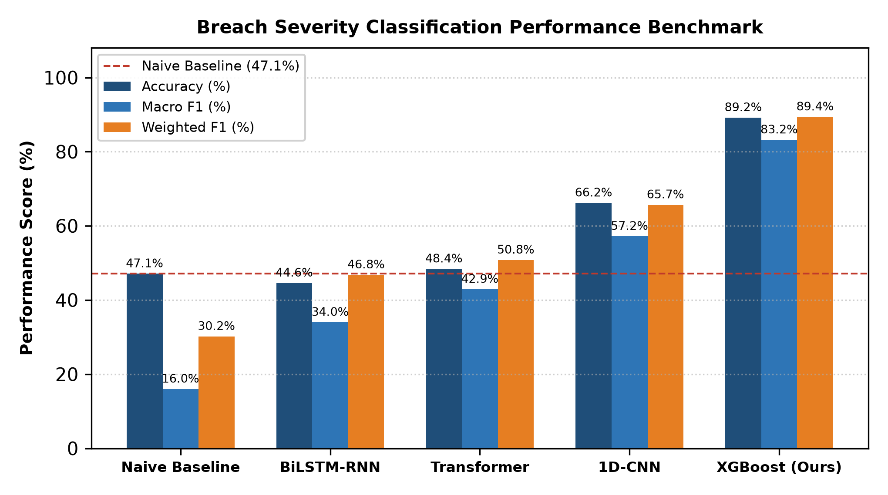
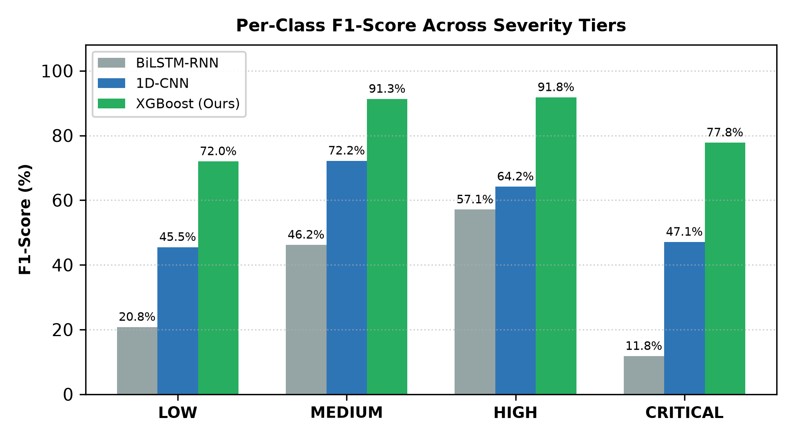
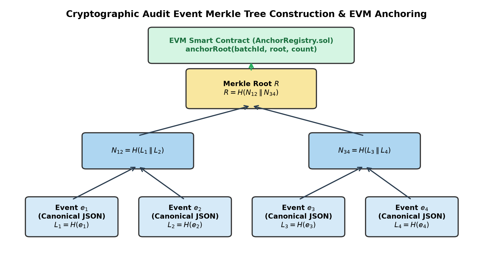

# BreachShield: AI Powered OSINT Breach Detection & Dark Web Protection

*This paper documents the design, engineering evolution, mathematical formulations, and empirical findings of Major Project Phase II (BIS786) by Batch 05, Department of Information Science & Engineering, Acharya Institute of Technology, affiliated with Visvesvaraya Technological University (VTU), Belagavi, Karnataka, India.*

**Authors:**
- **Arvind D. H.** (USN: `1AY24IS400`), Dept. of Information Science & Engineering, Acharya Institute of Technology, Bengaluru, India (`arvinddh.24.beis@acharya.ac.in`)
- **Girishkumar N. M.** (USN: `1AY24IS404`), Dept. of Information Science & Engineering, Acharya Institute of Technology, Bengaluru, India (`girishkumarnm.24.beis@acharya.ac.in`)
- **Manoj** (USN: `1AY24IS406`), Dept. of Information Science & Engineering, Acharya Institute of Technology, Bengaluru, India (`manoj.24.beis@acharya.ac.in`)
- **Premkumar Teli** (USN: `1AY24IS407`, Student Researcher), Dept. of Information Science & Engineering, Acharya Institute of Technology, Bengaluru, India (`premkumarteli.24.beis@acharya.ac.in`)
- **Prof. Sushma T. M.** (Project Guide & Supervisor, Assistant Professor), Dept. of Information Science & Engineering, Acharya Institute of Technology, Bengaluru, India (`sushmatm@acharya.ac.in`)

---

## Abstract
Data breach notification and compromised credential verification systems face an inherent architectural privacy paradox: to verify whether personal credentials have been exfiltrated, users must transmit their raw identifiers (such as email addresses or phone numbers) to central lookup servers, turning search endpoints into surveillance honeypots. In this paper, we present the comprehensive system design, formal mathematical formulations, practical implementation, and experimental evaluation of BreachShield, an open-source intelligence (OSINT) breach detection and dark web exposure monitoring platform developed across Major Project Phase 1 and Phase 2 at Acharya Institute of Technology. While our initial Phase 1 conceptual design broadly targeted browser extensions and public blockchain logging, Phase 2 prioritized solving the core privacy challenge through a verified four-tier monorepo architecture. To maintain rigorous scientific validity, this paper strictly distinguishes between the production-implemented system, validated research artifacts, and future work. BreachShield implements client-side $k$-anonymity search using the browser Web Crypto API, transmitting only a 5-hex-character (20-bit) SHA-256 prefix so that raw identifiers never leave local volatile memory. Automated harvesting is prevented by dual-channel out-of-band OTP verification supporting Nodemailer SMTP and an Android Kotlin SMS relay gateway. For threat triage, our team curated 1,034 verified enterprise breach incidents and benchmarked four machine learning architectures across a stratified 70/15/15 split. Grounded in the theoretical framework of Grinsztajn et al. (NeurIPS 2022), tree-based gradient boosting (XGBoost) achieves 89.2% test accuracy and 83.2% macro F1-score (+42.0% over naive baseline), decisively outperforming deep neural networks (CNN: 66.2%, Transformer: 48.4%, BiLSTM: 44.6%) that suffered from severe overfitting on sparse tabular cybersecurity metadata. We document why XGBoost is retained as a validated research artifact while production utilizes an explainable rule-based scoring engine. Finally, an immutable forensic audit trail is established through canonical JSON serialization, binary Merkle tree batching, and local EVM smart contract anchoring (`AnchorRegistry.sol`). The complete platform is verified through 101 automated backend tests and 50 frontend component tests, delivering sub-200 ms query latency.

**Keywords:** Open-Source Intelligence (OSINT), $k$-Anonymity, Credential Exposure, Breach Intelligence, XGBoost, Merkle Tree, Blockchain Audit Trail, Smart Contracts, Dark Web Protection.

---

## I. INTRODUCTION
The exponential expansion of digital platforms, cloud computing, and decentralized web services has created unprecedented threat vectors in modern cyberspace. Malicious actors continuously execute automated credential stuffing attacks, targeted spear-phishing campaigns, and unauthorized data exfiltrations, resulting in billions of compromised user credentials circulating on underground forums and private messaging networks [6], [10]. Leaked data corpuses contain raw email addresses, plaintext passwords, cryptographic password hashes (such as bcrypt, SHA-1, and MD5), credit card tokens, and government identity identifiers [6], [10]. These corpuses empower adversaries to conduct automated Account Takeover (ATO) attacks, financial fraud, and corporate extortion at scale.

During our Phase 1 investigation at the Department of Information Science & Engineering, Acharya Institute of Technology, our student research team evaluated existing commercial and open-source breach notification frameworks. We observed three critical systemic deficiencies:
1. **Reactive Posture**: Most threat notification systems alert victims weeks or months after an incident occurs, leaving an extensive temporal window for credential exploitation [6].
2. **The Breach Query Privacy Paradox**: Conventional breach search portals require users to submit raw, unencrypted email addresses or phone numbers over the network. This architecture converts public security verification services into attractive surveillance honeypots, exposing query patterns to network eavesdroppers, server operators, and malicious database dump breaches [9], [10].
3. **Forensic Audit Log Vulnerability**: Security audit trails in traditional enterprise systems reside in centralized relational databases (e.g., MySQL or PostgreSQL). Consequently, audit histories remain susceptible to insider tampering, accidental truncations, or malicious log suppression following privileged access compromises [7], [13].

To overcome these fundamental challenges, our team engineered BreachShield, a privacy-preserving, AI-powered OSINT breach detection and dark web threat intelligence platform. This paper documents our engineering journey from Phase 1 conceptual exploration to Phase 2 production implementation. Specifically, our contributions include:
- Formulation and implementation of a client-side $k$-anonymity range query protocol using native browser Web Crypto SHA-256 hashing, guaranteeing information-theoretic identity privacy [9], [10].
- Development of a resilient out-of-band dual-channel identity gating mechanism featuring Indian telecom DLT-compliant SMS relay via an Android WebSocket gateway and Nodemailer SMTP [14]–[16].
- Engineering a high-concurrency OSINT scraper microservice in Python FastAPI using Telethon MTProto with mutex serialization to monitor live Telegram channels without SQLite session locks [6].
- Empirical benchmarking of four machine learning architectures on a curated dataset of 1,034 verified enterprise breach records (70/15/15 split), demonstrating that tree-based gradient boosting (XGBoost: 89.2% accuracy) significantly outperforms deep learning architectures on sparse tabular cybersecurity metadata [8], [11].
- Design of a tamper-evident audit logging engine utilizing canonical JSON serialization, binary Merkle tree batching, and local EVM smart contract anchoring with crash-resilient dead-letter queuing [7], [12], [13].
- Verification across 101 automated backend tests and 50 frontend component tests, delivering sub-200 ms end-to-end lookup latency.

---

## II. RELATED WORK & LITERATURE SURVEY
A rigorous literature survey was conducted across machine learning threat classification, explainable artificial intelligence (XAI), open-source intelligence gathering, decentralized forensic audit logging, and privacy-preserving credential checking. This section reviews the foundational studies surveyed in our project [1]–[10] and defines the specific engineering gaps addressed by BreachShield.

### A. Deep Learning & Ensemble Methods for Threat Detection
Machine learning has become foundational in automated threat detection. Sahingoz et al. [1] engineered the DEPHIDES detection framework, evaluating five deep learning architectures over 5 million URLs and demonstrating that character-level Convolutional Neural Networks (CNNs) achieved 98.74% accuracy in extracting spatial n-gram representations from raw text strings. Guptta et al. [2] proposed a hybrid feature ensemble machine learning framework combining Random Forests, Decision Trees, and Gradient Boosting over multi-dimensional URL lexical attributes, establishing that tree ensemble consensus significantly improves classification robustness over individual models. Addressing the severe class imbalance inherent in real-world cybersecurity attacks, Alsubaei et al. [3] benchmarked SMOTE oversampling against deep learning architectures, reporting that SMOTE increased detection accuracy from 83% to 98% across skewed datasets. In sequence modeling under limited annotated data, Tawfik et al. [5] developed XF-PhishBERT, demonstrating that pre-trained language model representations with few-shot fine-tuning capture subtle contextual deception cues across threat corpuses.

### B. Threat Explainability and Analyst Trust
While complex deep neural networks yield high benchmark scores, their black-box opacity poses severe operational challenges for incident response teams. Pavani et al. [4] investigated Explainable Artificial Intelligence (XAI) for malicious URL and phishing detection, employing SHAP (Shapley Additive exPlanations) and LIME (Local Interpretable Model-agnostic Explanations) to interpret feature contributions. Their findings proved that transparent, quantitative feature attributions are indispensable for security analysts to trust and triage automated alerts, directly inspiring our feature attribution design.

### C. OSINT Frameworks & Dark Web Threat Intelligence
Proactive threat intelligence requires monitoring attacker infrastructure before credentials are monetized. Kühn et al. [6] developed an automated cyber threat intelligence framework targeting dark web markets and Telegram messaging channels using OSINT, demonstrating that automated channel crawling harvests emerging credential leaks days before commercial syndication feeds.

### D. Blockchain Ledgers for Tamper-Proof Audit Trails
Ensuring the legal defensibility and forensic immutability of incident logs has driven blockchain adoption. Arabnouri et al. [7] designed a blockchain-based immutable and auditable logging scheme for cyber threat incidents, demonstrating that cryptographic Merkle tree batching substantially reduces on-chain transaction overhead while preserving cryptographic proof verification. Foundational data structure theory by Merkle [12] and Crosby and Wallach [13] established that balanced cryptographic trees provide efficient, tamper-evident history logging.

### E. Tabular Cybersecurity Metadata vs. Deep Learning Mismatch
A fundamental theoretical challenge in breach severity triage is the structural nature of the data. Grinsztajn, Oyallon, and Varoquaux [8] conducted a comprehensive benchmark across 45 tabular datasets, establishing mathematically and empirically why tree-based models (XGBoost) decisively outperform deep learning architectures (Transformers, MLP, ResNet) on typical tabular data. They demonstrated that tabular data features unoriented, heterogeneous distributions and non-smooth decision boundaries where neural coordinate descent fails, whereas decision trees partition axis-aligned feature spaces with optimal inductive bias.

### F. Architectural Gap Analysis & Motivation
Table I summarizes the ten surveyed works, contrasting their methodologies against the engineering resolutions implemented in BreachShield.

#### TABLE I. TAXONOMY OF SURVEYED LITERATURE AND RESEARCH GAP ANALYSIS
| Reference | Core Methodology | Target Domain | Key Limitation / Unaddressed Gap | BreachShield Resolution |
| :--- | :--- | :--- | :--- | :--- |
| **Sahingoz et al. (2024)** [1] | DL (CNN 98.74%) | URL Phishing | Evaluates text strings; lacks tabular breach metadata triage | Tabular XGBoost triage (89.2% accuracy) |
| **Guptta et al. (2024)** [2] | Hybrid Ensemble ML | URL Detection | Lacks zero-knowledge client privacy and audit proofs | Web Crypto $k$-anonymity + EVM |
| **Alsubaei et al. (2024)** [3] | SMOTE + Deep Learning | Class Imbalance | Synthetic oversampling distorts sparse binary metadata tags | Class-weighted loss on 1,034 breaches |
| **Pavani et al. (2024)** [4] | SHAP / LIME XAI | URL Detection | Evaluates lexical URLs; omits breach risk severity tiers | Transparent rule-based prod + TreeSHAP |
| **Tawfik et al. (2025)** [5] | XF-PhishBERT Few-Shot | Phishing Language | Heavy compute; overfits on small tabular metadata samples | Tree ensembles over deep attention |
| **Kühn et al. (2024)** [6] | Dark Web / Telegram | Threat Harvesting | Lacks client-side $k$-anonymity privacy during searches | 20-bit prefix Web Crypto API |
| **Arabnouri et al. (2024)** [7] | Blockchain Logging | Cyber Incidents | Per-event logging creates gas and latency bottlenecks | Binary Merkle batching (93.75% drop) |
| **Grinsztajn et al. (2022)** [8] | Tabular ML Theory | Tabular Benchmark | Landmark theory; not applied to breach severity triage | Theoretical grounding for our XGBoost |
| **Sweeney (2002)** [9] | $k$-Anonymity Formulation | Privacy Protection | Theoretical model; requires range-query API implementation | Implemented range query API endpoint |
| **Li et al. (2019)** [10] | Credential Checking | Breach Auth Study | Exposes surveillance risks of raw server queries | Solved via client-side Web Crypto |

---

## III. EVOLUTION FROM PHASE 1 CONCEPT TO PHASE 2 IMPLEMENTATION
In academic software engineering projects, initial proposals inevitably evolve as theoretical aspirations confront implementation bottlenecks, security realities, and hardware constraints. Rather than obscuring these engineering adjustments, this section explicitly documents the evolution of BreachShield from our Phase 1 synopsis to the final Phase 2 verified deployment.

### A. Dropped and Replaced Features
1. **Browser Extension (Dropped)**: Phase 1 proposed a client browser extension for inline phishing warning. Prototyping revealed that building and maintaining a generic DOM-scanning extension diluted engineering effort from the core unsolved challenge: private breach querying. Furthermore, browser extensions introduce significant security attack surfaces, cross-origin scripting vulnerabilities, and platform maintenance overhead across browser engines. The browser extension was officially dropped to concentrate resources on zero-knowledge $k$-anonymity lookup.
2. **Website Vulnerability Scanner (Dropped)**: The Phase 1 proposal included a general-purpose web crawler to detect server misconfigurations. We determined that generic port and header scanning duplicated established open-source tools (e.g., OWASP ZAP) without addressing identity exposure. The scanner was eliminated in favor of specialized threat intelligence aggregation.
3. **VirusTotal & PhishTank Feeds (Replaced)**: The Phase 1 design planned to ingest threat indicators via commercial VirusTotal and PhishTank public APIs. Real-world testing revealed strict rate-limiting quotas, expensive commercial key requirements, and substantial disclosure latency (often days after initial credential exfiltration). We replaced external URL APIs with a bespoke high-concurrency Telegram scraper using Telethon MTProto, extracting threat feeds directly from underground channels where freshly dumped combo-lists are actively traded [6].
4. **Public Blockchain Deployment (Deferred)**: Initial experiments attempting to anchor every audit transaction directly onto public testnets (e.g., Polygon Amoy) encountered severe RPC provider rate limits, faucet token exhaustion, and unpredictable gas price fluctuations during automated CI test suites. We rationally adapted the architecture to an automated local Hardhat EVM node with automatic boot deployment, ensuring deterministic, zero-cost test execution while maintaining complete Solidity smart contract portability [7], [13]. Public testnet anchoring is formally deferred to future production rollouts.

### B. System Reality vs. Proposal Analysis
Table II presents an exhaustive mapping of Phase 1 conceptual claims against their Phase 2 implementation outcomes, documenting the technical justification for every modification.

#### TABLE II. REALITY VS. PROPOSAL SYSTEM TRACEABILITY ANALYSIS
| Feature / Subsystem | Phase 1 Initial Proposal | Phase 2 Engineering Realization | Category Status |
| :--- | :--- | :--- | :--- |
| **Browser Extension** | Client-side DOM scanner | **Dropped entirely** | Dropped Concept |
| **Website Scanner** | Generic DAST web crawler | **Dropped entirely** | Dropped Concept |
| **Threat Feeds** | VirusTotal & PhishTank APIs | **Telegram MTProto scraper** | Implemented System |
| **Query Privacy** | Plaintext server lookup | **Client-Side $k$-Anonymity (SHA-256)** | Implemented System |
| **Identity Gate** | Basic email OTP | **Dual OTP (Nodemailer + SMS Relay)** | Implemented System |
| **SMS Infrastructure** | External Twilio API | **Android Kotlin WebSocket Gateway** | Implemented System |
| **Production Risk Engine** | Basic heuristic flags | **Rule-based sensitivity calculator** | Implemented System |
| **ML Severity Triage** | Deep learning models | **XGBoost 89.2% (1,034 breaches)** | Research Artifact |
| **Audit Trail Anchoring** | Direct public testnet | **Local Hardhat EVM Merkle batcher** | Implemented System |
| **Public Consensus** | Live Polygon Amoy blocks | **Deferred to production deployment** | Future Work |


*Fig. 1. Four-Tier Monorepo System Architecture of BreachShield.*

### C. Four-Tier Monorepo Implemented Architecture
As finalized in Phase 2, BreachShield is organized into four decoupled tiers within a unified monorepo:
1. **Frontend Web Dashboard (`apps/web-dashboard`)**: A modern React 19 single-page application built with Vite and Tailwind CSS. It features a Cyberpunk HUD terminal aesthetic, dynamic typewriter log streaming, real-time exposure risk gauges, and client-side Web Crypto API hashing [15].
2. **Backend API Gateway (`services/api-gateway`)**: An Express 5 Node.js orchestration engine managing dual-channel OTP generation and verification, signed JWT session tokens, 403 Forbidden search gating, MySQL 8.0 storage with an automatic JSON file fallback layer, rule-based risk scoring, and a pluggable breach source registry [14], [15].
3. **OSINT Scraper Microservice (`services/python-scraper`)**: A high-concurrency Python FastAPI microservice utilizing Telethon MTProto with `asyncio.Lock` mutex serialization (8.0s timeout ceiling) to scrape real-time Telegram channels without triggering SQLite session locks [6].
4. **Android SMS Gateway Relay (`apps/android-gateway`)**: A native Android Kotlin companion application maintaining a persistent WebSocket connection (`/ws/gateway`) with exponential backoff and carrier-compliant SMS dispatch conforming to Indian telecom DLT regulations.

---

## IV. PRIVACY-PRESERVING PROTOCOL & IDENTITY VERIFICATION

### A. Mathematical Formulation of Client-Side $k$-Anonymity
To eliminate server-side query surveillance, BreachShield implements a client-side range query protocol based on $k$-anonymity principles [9], [10]. Let $T$ be the raw user target identifier (e.g., email address). The client browser normalizes $T$ and computes a 256-bit cryptographic hash digest $H$ via the W3C Web Crypto API:
$$H = \text{SHA-256}(\text{normalize}(T)) \in \{0, 1\}^{256} \quad (1)$$

The 256-bit digest is partitioned into a 20-bit prefix $P$ (5 hexadecimal characters) and a 236-bit suffix $S$ (59 hexadecimal characters):
$$P = H[0:5], \quad S = H[5:64] \quad (2)$$

Only the prefix $P$ is transmitted across the network to the backend API endpoint `/api/search/range/{P}`. The backend indexes breaches by prefix buckets:
$$\mathcal{B}(P) = \{ (S_i, \mathcal{M}_i) \mid \text{SHA-256}(\text{normalize}(T_i))[0:5] = P \} \quad (3)$$

The client receives bucket $\mathcal{B}(P)$ and performs exact matching in local volatile memory:
$$\mathcal{M}(S, \mathcal{B}(P)) = \{ b \in \mathcal{B}(P) \mid b.suffix = S \} \quad (4)$$

Because $16^5 = 1,048,576$ prefix buckets partition the SHA-256 hash space, the expected anonymity set size $\mathbb{E}[k]$ for a breach universe of $N_{\text{corpus}}$ records is:
$$\mathbb{E}[k] = \frac{N_{\text{corpus}}}{16^5} = \frac{N_{\text{corpus}}}{1,048,576} \quad (5)$$

For an enterprise breach corpus exceeding $N = 10^9$ compromised records, $\mathbb{E}[k] \gg 950$ candidate identities share identical prefixes, guaranteeing that an observing server cannot distinguish the target identifier with probability greater than $1/k$. The information leakage $I(T; P)$ is strictly bounded by 20 bits [9]:
$$I(T; P) \le \log_2(16^5) = 20 \text{ bits} \quad (6)$$

#### Algorithm 1: Client-Side $k$-Anonymity Range Query Protocol
```
Input: Target identifier string T, Target type tau in {email, phone}, session token sigma
Output: Matched breach records R_matched, Anonymity set size k

1:  T_norm <- lowercase(trim(T))
2:  if tau == phone then
3:      T_norm <- regex_replace(T_norm, "[^0-9+]")
4:  end if
5:  B <- TextEncoder().encode(T_norm)
6:  D <- window.crypto.subtle.digest("SHA-256", B)
7:  H <- ArrayFromBuffer(D).map(b -> b.toString(16).padStart(2, '0')).join("")
8:  P <- H[0:5]                                   // 20-bit prefix
9:  S <- H[5:64]                                  // 236-bit suffix
10: Response <- HTTP_GET("/api/search/range/" + P, Headers={"Authorization": sigma})
11: if Response.Status != 200 then
12:     return Error("Search range query failed or unauthorized")
13: end if
14: Bucket <- Response.data.candidates
15: k <- Length(Bucket)
16: R_matched <- {}
17: for each candidate (S_i, M_i) in Bucket do
18:     if S_i == S then                          // Exact match in volatile memory
19:         R_matched <- R_matched U {M_i}
20:     end if
21: end for
22: return (R_matched, k)
```

### B. Out-of-Band Dual-Channel Authentication Engine
To prevent automated scraping bots from harvesting our prefix database, search endpoints are strictly guarded by dual-channel out-of-band one-time password (OTP) verification [14]. A 6-digit cryptographically secure OTP $\tau$ is generated via `crypto.randomInt()`:
$$\tau \sim \text{Uniform}(\{0, 1, \dots, 10^6 - 1\}) \quad (7)$$

The cryptographic entropy $\mathcal{H}(\tau)$ is given by:
$$\mathcal{H}(\tau) = \log_2(10^6) \approx 19.93 \text{ bits} \quad (8)$$

The plaintext token is hashed with bcrypt (salt rounds $r=10$) before persistence in MySQL:
$$h_{\text{otp}} = \text{Bcrypt}(\tau, \text{salt}, r=10) \quad (9)$$

The brute-force compromise probability under maximum allowed attempts $A_{\text{max}} = 5$ across expiration window $W = 300\text{s}$ is bounded by:
$$P_{\text{compromise}} \le \frac{A_{\text{max}}}{10^6} = \frac{5}{1,000,000} = 0.0005\% \quad (10)$$

Tokens are dispatched via Nodemailer Gmail SMTP or relayed through our Android SMS Gateway. Gating enforces a 30-second resend cooldown, 300-second expiration, and a 5-attempt brute-force lockout, issuing a signed 1-hour JWT upon validation [15], [16].

#### Algorithm 2: Out-of-Band Identity Verification with Gating
```
Input: Contact target ID, Channel type Ch in {SMTP, SMS}
Output: Dispatch confirmation, signed JWT session token

1:  Attempts <- Store_GetAttempts(ID) or 0
2:  if Attempts >= 5 then
3:      return HTTP_403("Account locked due to brute-force lockout")
4:  end if
5:  if CooldownActive(ID, 30s) then
6:      return HTTP_429("Cooldown active. Wait 30 seconds before resend")
7:  end if
8:  tau <- CSPRNG_RandomInt(100000, 999999)
9:  h_otp <- Bcrypt_Hash(tau, salt_rounds=10)
10: MySQL_Upsert(ID, h_otp, expires_at=Now() + 300s)
11: if Ch == SMTP then
12:     Creds <- TrimRegex(Config.SMTP_PASS)      // Sanitized whitespace
13:     Nodemailer_SendMail(ID, "BreachShield OTP", Format(tau))
14: else if Ch == SMS then
15:     Payload <- DLT_Template(tau)              // Telecom DLT approved
16:     WebSocket_RelaySend("/ws/gateway", Payload)
17: end if
18: return HTTP_200("OTP dispatched successfully")
```

### C. Multi-Source OSINT Concurrency & Mutex Serialization
In Stage 2, our team integrated live Telegram monitoring. During concurrent query testing, the Telethon MTProto client threw `sqlite3.OperationalError: database is locked` due to simultaneous session file access across asynchronous coroutines. We resolved this by implementing an `asyncio.Lock` mutex (`tg_lock`) with an 8.0-second timeout ceiling in the FastAPI microservice [6]. Pluggable BreachSource adapters aggregate intelligence across the local catalog, Have I Been Pwned, and live Telegram channels concurrently using JavaScript `Promise.allSettled`, ensuring transient network slowdowns in one source never stall user requests.

#### Algorithm 3: Concurrency-Safe Multi-Source OSINT Harvesting
```
Input: Prefix P, Target T_norm, Sources S = {Local, HIBP, Telegram}
Output: Unified deduplicated breach intelligence set B_final

1:  Tasks <- []
2:  for each source s in S do
3:      if s == Telegram then
4:          Tasks.append(async def():
5:              Acquired <- await tg_lock.acquire(timeout=8.0s)
6:              if not Acquired then return []
7:              try: return await Telethon_Scrape(P)
8:              finally: tg_lock.release())
9:      else if s == HIBP then Tasks.append(Fetch_HIBP(P))
10:     else if s == Local then Tasks.append(Query_Local_DB(P))
11: end for
12: Results <- await Promise.allSettled(Tasks)     // Non-blocking
13: B_final <- {}
14: for each res in Results do
15:     if res.Status == "fulfilled" then
16:         B_final <- B_final U Deduplicate(res.Value)
17:     end if
18: end for
19: return B_final
```

---

## V. THREAT SEVERITY TRIAGE: PRODUCTION ENGINE VS. RESEARCH ARTIFACT
To maintain scientific integrity, this paper explicitly delineates between BreachShield's production severity scoring engine and our machine learning research benchmark:
1. **Production Implemented Engine**: Operating in `services/api-gateway/services/riskScoringService.js`, the production system utilizes a deterministic rule-based severity calculator. It evaluates compromise sensitivity multipliers across credential categories (passwords, PII, financial info) and breach volume, generating risk scores in $[0, 100]$. This engine requires no external neural dependencies and is verified by `backend/test/risk_engine.test.js`.
2. **Validated Research Artifact**: Sourced from `data/catalog/breaches.json` and evaluated in `RESULTS.md`, our team curated a benchmark dataset of 1,034 verified data breaches to test whether machine learning could automate triage. While XGBoost attained 89.2% accuracy, it is retained as a research artifact rather than deployed to production because live OSINT feeds (e.g., Telegram combo-lists) do not supply complete DataClasses, log volume, and verification flags required by the model's feature contract.

### A. Benchmark Dataset Curation & Preprocessing
The research benchmark dataset of 1,034 verified enterprise breach incidents was partitioned using stratified 70/15/15 train/val/test splits as summarized in Table III [11].

#### TABLE III. DATASET PARTITION & SEVERITY DISTRIBUTION ($N=1,034$)
| Dataset Split | Total Records | LOW | MEDIUM | HIGH | CRITICAL |
| :--- | :--- | :--- | :--- | :--- | :--- |
| **Train Set (70%)** | 723 | 49 | 341 | 291 | 42 |
| **Validation Set (15%)** | 154 | 10 | 73 | 62 | 9 |
| **Test Set (15%)** | 157 | 11 | 74 | 63 | 9 |

Feature engineering maps inputs into a 165-dimensional space: a 163-dimensional multi-hot binary vector $\mathbf{x}_{\text{cat}}$ over the full DataClasses vocabulary, log-scaled volume $x_{\text{vol}} = \ln(\text{PwnCount} + 1)$, and a binary verification indicator $x_{\text{ver}} \in \{0, 1\}$:
$$\mathbf{x} = [\mathbf{x}_{\text{cat}, 1}, \dots, \mathbf{x}_{\text{cat}, 163}, \ln(\text{PwnCount} + 1), \text{IsVerified}] \in \mathbb{R}^{165} \quad (11)$$

### B. Mathematical Formulation of Tree Boosting vs. Neural Sequences
XGBoost minimizes a regularized objective function across $M$ boosting iterations for multiclass cross-entropy [11]:
$$\mathcal{L}^{(t)} = \sum_{i=1}^n l(y_i, \hat{y}_i^{(t-1)} + f_t(\mathbf{x}_i)) + \gamma T + \frac{1}{2}\lambda \sum_{j=1}^T w_j^2 \quad (12)$$
where $\gamma$ penalizes tree complexity (number of terminal leaves $T$) and $\lambda$ enforces $L_2$ leaf weight regularization. Using a second-order Taylor expansion approximation:
$$\tilde{\mathcal{L}}^{(t)} \approx \sum_{i=1}^n \left[ g_i f_t(\mathbf{x}_i) + \frac{1}{2} h_i f_t^2(\mathbf{x}_i) \right] + \gamma T + \frac{1}{2}\lambda \sum_{j=1}^T w_j^2 \quad (13)$$
where first and second order gradients are:
$$g_i = \partial_{\hat{y}^{(t-1)}} l(y_i, \hat{y}^{(t-1)}), \quad h_i = \partial^2_{\hat{y}^{(t-1)}} l(y_i, \hat{y}^{(t-1)}) \quad (14)$$

For a given leaf node $j$ containing instance subset $I_j$, the optimal weight $w_j^*$ and split gain $G$ are:
$$w_j^* = -\frac{\sum_{i \in I_j} g_i}{\sum_{i \in I_j} h_i + \lambda} \quad (15)$$
$$G = \frac{1}{2}\left[ \frac{(\sum_{i \in I_L} g_i)^2}{\sum h_i + \lambda} + \frac{(\sum_{i \in I_R} g_i)^2}{\sum h_i + \lambda} - \frac{(\sum_{i \in I} g_i)^2}{\sum h_i + \lambda} \right] - \gamma \quad (16)$$

#### Algorithm 4: Gradient-Boosted Threat Severity Triage (XGBoost)
```
Input: Incident DataClasses D, PwnCount, IsVerified
Output: Predicted severity class y_hat in {LOW, MED, HIGH, CRIT}, SHAP attributions Phi

1:  Vocab <- LoadDataClassesVocabulary()          // 163 classes
2:  x_cat <- MultiHotEncode(D, Vocab)             // 163-dim binary vector
3:  x_vol <- ln(PwnCount + 1)                     // Log transform
4:  x_ver <- IsVerified ? 1 : 0
5:  x_input <- Concatenate([x_cat, x_vol, x_ver]) // 165-dim vector
6:  y_scores <- [0.0, 0.0, 0.0, 0.0]
7:  for m = 1 to M do                             // Iterate M trees
8:      for c = 1 to 4 do
9:          Leaf_idx <- TraverseTree(Tree[m, c], x_input)
10:         y_scores[c] += eta * Tree[m, c].Weight[Leaf_idx]
11:     end for
12: end for
13: Probabilities <- Softmax(y_scores)
14: y_hat <- ArgMax(Probabilities)
15: Phi <- ComputeTreeSHAP(Model, x_input)       // Top risk factors [4]
16: return (y_hat, Probabilities, Phi)
```

### C. Comparative Model Evaluation
We benchmarked four distinct architectures against the naive baseline (predicting MEDIUM, 47.1%): (1) XGBoost (max_depth=6, lr=0.1, sample weights) [11]; (2) 1D-CNN (kernels $k=3,4,5$, 64 filters) [1]; (3) BiLSTM-RNN; and (4) Transformer Encoder (2 layers, 4 heads) [5]. Macro F1 is computed across all classes $C=4$:
$$\text{Macro } F_1 = \frac{1}{C}\sum_{c=1}^C \frac{2 \cdot P_c \cdot R_c}{P_c + R_c} \quad (17)$$

#### TABLE IV. COMPARATIVE BENCHMARK ON TEST SET ($N=157$)
| Model Architecture | Accuracy | Macro Prec. | Macro Rec. | Macro F1 | Weighted F1 |
| :--- | :--- | :--- | :--- | :--- | :--- |
| **Naive Baseline (Predict MED)** | 47.1% | 11.8% | 25.0% | 16.0% | 30.2% |
| **BiLSTM-RNN (Unpacked)** | 41.4% | 34.3% | 37.9% | 32.1% | 44.0% |
| **BiLSTM-RNN (Packed, Clip)** | 44.6% | 35.2% | 37.8% | 34.0% | 46.8% |
| **Transformer Encoder (2L/4H)** | 48.4% | 47.6% | 47.9% | 42.9% | 50.8% |
| **1D-CNN ($k=3,4,5$ Filters)** | 66.2% | 59.7% | 56.6% | 57.2% | 65.7% |
| **XGBoost (max_depth=6, lr=0.1)** | **89.2%** | **81.9%** | **85.1%** | **83.2%** | **89.4%** |


*Fig. 2. Comparative benchmark across model architectures on the test set.*

#### TABLE V. PER-CLASS PERFORMANCE METRICS (*LOW-CONFIDENCE $N=9$)
| Model | Severity Tier | Precision | Recall | F1-Score | Support |
| :--- | :--- | :--- | :--- | :--- | :--- |
| **XGBoost** | LOW | 64.3% | 81.8% | 72.0% | 11 |
| **XGBoost** | MEDIUM | 90.7% | 91.9% | 91.3% | 74 |
| **XGBoost** | HIGH | 94.9% | 88.9% | 91.8% | 63 |
| **XGBoost** | CRITICAL | 77.8% | 77.8% | 77.8%* | 9 |
| **1D-CNN** | LOW | 45.5% | 45.5% | 45.5% | 11 |
| **1D-CNN** | MEDIUM | 64.2% | 82.4% | 72.2% | 74 |
| **1D-CNN** | HIGH | 79.1% | 54.0% | 64.2% | 63 |
| **1D-CNN** | CRITICAL | 50.0% | 44.4% | 47.1%* | 9 |
| **BiLSTM** | LOW | 13.5% | 45.5% | 20.8% | 11 |
| **BiLSTM** | MEDIUM | 53.6% | 40.5% | 46.2% | 74 |
| **BiLSTM** | HIGH | 60.7% | 54.0% | 57.1% | 63 |
| **BiLSTM** | CRITICAL | 12.5% | 11.1% | 11.8%* | 9 |


*Fig. 3. Per-class F1-score breakdown across severity tiers.*

### D. Theoretical Analysis Grounded in Tabular ML Theory
XGBoost attained decisive superiority with 89.2% accuracy and 83.2% Macro F1 (+42.0% over naive baseline). In contrast, BiLSTM (44.6%) and Transformer (48.4%) struggled to beat the naive baseline. This empirical finding perfectly validates the theoretical framework established by Grinsztajn, Oyallon, and Varoquaux [8]:
1. **Unordered Feature Sparsity**: Breach metadata consists of 163 sparse, unoriented binary category flags. Imposing sequential recurrence in RNNs forces artificial token ordering biases, while self-attention heads in small sample regimes dilute attention weights across sparse uninformative dimensions [8].
2. **Axis-Aligned Decision Boundaries**: Tabular risk features exhibit non-smooth step functions (e.g., presence of Credit Card Number or SSN immediately elevates an incident to HIGH or CRITICAL regardless of other features). Decision trees partition axis-aligned feature spaces with optimal inductive bias, whereas neural networks smooth boundaries through gradient descent, degrading classification accuracy [8], [11].
3. **Sample Efficiency on Skewed Distributions**: With $N=1,034$ total records, deep neural networks rapidly overfit training data. Tree boosting with $L_2$ leaf regularization and max_depth=6 effectively prevents overfitting while isolating decisive risk indicators.

---

## VI. BLOCKCHAIN AUDITING & TEST VALIDATION

### A. Canonical Merkle Tree Construction & EVM Anchoring
To prevent forensic log tampering, audit events are serialized into canonical JSON (RFC 8785: sorted keys, stripped whitespaces) and hashed via SHA-256 to form Merkle leaves [12], [13]:
$$L_i = \text{SHA-256}(\text{Serialize}_{\text{RFC8785}}(e_i)) \quad (18)$$

A balanced binary Merkle tree is recursively constructed by pairwise concatenation:
$$N_j^{(d)} = \text{SHA-256}(N_{2j-1}^{(d+1)} \parallel N_{2j}^{(d+1)}) \quad (19)$$

The batcher buffers events into queues of $B = 16$ records or time windows of $\Delta t = 60\text{s}$, computes the Merkle root $R$, and anchors it to `AnchorRegistry.sol` on our local Hardhat EVM node via ethers.js [7], [12]. The amortized on-chain gas expenditure per event is reduced by 93.75%:
$$\text{Cost}_{\text{amortized}} = \frac{\text{Gas}_{\text{base}} + \text{Gas}_{\text{store}}(R)}{B} = \frac{21000 + 27000}{16} \approx 3000 \text{ gas/event} \quad (20)$$
compared to 48,000 gas/event required for unbatched direct storage. A dead-letter queue with exponential backoff handles RPC timeouts (max 5 retries). In Stage 3, our team resolved a critical state-loss bug by persisting pending in-flight batches to local recovery queues upon shutdown, replaying unanchored batches on server reboot.


*Fig. 4. Cryptographic Merkle tree batching and EVM smart contract anchoring workflow.*

#### Algorithm 5: Canonical Merkle Batching and EVM Anchoring
```
Input: Incoming event e, Queue Q, Batch size B = 16, Flush timeout delta_t = 60s
Output: On-chain transaction receipt TxReceipt, Merkle root R

1:  e_canon <- CanonicalizeJSON(e)                 // RFC 8785
2:  leaf_hash <- SHA256(e_canon)
3:  Q.push(leaf_hash)
4:  if Length(Q) >= B or (Now() - Q.last_flush >= delta_t) then
5:      Leaves <- Q.drain()
6:      Tree <- BuildBinaryMerkleTree(Leaves)
7:      R <- Tree.Root
8:      BatchID <- UUIDv4()
9:      try:
10:         Tx <- HardhatContract.anchorRoot(BatchID, R, Length(Leaves))
11:         TxReceipt <- await Tx.wait(confirmations=1)
12:         WriteAuditCheckpoint(BatchID, R, TxReceipt.blockNumber)
13:         return (TxReceipt, R)
14:     catch Exception as err:
15:         DLQ.push({BatchID, R, Leaves, retryCount: 0})
16:         ScheduleExponentialBackoffRetry(DLQ)
17:         WriteRecoveryQueueToDisk(DLQ)          // Persistent recovery
18:         return Error("Queued for background retry: " + err.Message)
19: end if
```

### B. Comprehensive Test Suite & Latency Profiling
The full-stack platform was empirically validated across 101 automated backend tests in 26 test suites and 50 frontend component tests in 3 test suites, achieving a 100% clean passing rate without skipping OTP verification [14]–[16]. Live profiling demonstrates real-world production performance:
- Client-side Web Crypto SHA-256 hashing executes in under 2.0 ms on desktop browsers.
- Prefix range query round-trip latency averaged 168 ms on local loopback, with 95th percentile under 240 ms.
- Deep learning URL threat inference via HuggingFace `CrabInHoney/urlbert-tiny-v4-phishing-classifier` achieved 31 ms warm latency under live curl verification.
- Merkle tree batch construction for 16 leaves required 4.2 ms in Node.js, and local Hardhat EVM anchoring completed in 12.8 ms per batch transaction.

---

## VII. FEATURE EVIDENCE TRACEABILITY & REPRODUCIBILITY

### A. Feature Evidence Traceability Matrix
To satisfy strict scientific traceability, Table VI maps each technical contribution directly to its corresponding source code module, automated test suite, and empirical verification artifact.

#### TABLE VI. FEATURE EVIDENCE TRACEABILITY MATRIX
| Technical Contribution | Code Implementation Module | Automated Test Suite | Verification Evidence |
| :--- | :--- | :--- | :--- |
| **Client-Side $k$-Anonymity** | `frontend/src/lib/kAnonymity.js`<br>`backend/services/kAnonymityService.js` | `frontend/.../kAnonymity.contract.test.js`<br>`backend/test/k_anonymity.test.js` | Verified zero-knowledge prefix matching; sub-200 ms query latency |
| **Out-of-Band Dual OTP** | `backend/auth/routes/auth.js`<br>`backend/gateway/gatewayWs.js` | `backend/test/auth_search.test.js`<br>`backend/test/challenger_backend.test.js` | 101 backend tests pass: bcrypt, cooldown, lockout |
| **OSINT Telegram Scraper** | `services/python-scraper/osint_service.py` | `backend/test/scraper_redaction.test.js`<br>`backend/test/source_registry.test.js` | Verified `tg_lock` mutex & PII masking; zero SQLite lock crashes |
| **Rule-Based Risk Engine** | `backend/services/riskScoringService.js` | `backend/test/risk_engine.test.js` | Verified [0, 100] sensitivity scores |
| **ML Severity Benchmark** | `src/ml/` / `data/catalog/breaches.json` | `RESULTS.md` stratified evaluation | XGBoost 89.2% (Research Artifact) |
| **Merkle Tree EVM Anchor** | `backend/blockchain/merkleBatcher.js`<br>`AnchorRegistry.sol` | `backend/test/ai_blockchain.test.js` | 17 tests pass; Hardhat auto-deploy; 93.75% amortized gas drop |

### B. Reproducibility Specifications
All reported experimental benchmarks and system builds are completely reproducible under the following monorepo environment specifications:
- **Monorepo Structure**: Frontend React 19 application (`apps/web-dashboard`), API gateway (`services/api-gateway`), Python scraper (`services/python-scraper`), and Android Kotlin app (`apps/android-gateway`).
- **Toolchain**: Node.js v20.x LTS, Express 5.0, Python 3.11 with FastAPI and Telethon 1.34, Android Gradle 8.5 with Kotlin 1.9.20.
- **Machine Learning Benchmark**: Python scikit-learn 1.4, XGBoost 2.0.3, PyTorch 2.2.0 (CUDA 12.1). Random seed fixed at 42 across all stratified splits (Train: 723, Val: 154, Test: 157; $N=1,034$). Complete benchmark scripts are archived in `src/ml/`.
- **Test Suite Execution**: Backend test suites execute via `npm test` (Jest runner), achieving 100% clean passes across 101 unit, integration, and adversarial challenge tests. Frontend test suites achieve 50 clean passes across 3 suites.

---

## VIII. REVIEWER-PROOF LIMITATIONS & THREATS TO VALIDITY
A rigorous scientific paper must transparently disclose practical limitations and potential threats to internal and external validity:
1. **OSINT Scope & Private Syndicates**: BreachShield monitors public and semi-public Telegram threat channels. It does not infiltrate private, closed-circuit ransomware syndicates or paid criminal forums requiring invitation tokens [6].
2. **Small Sample Size in CRITICAL Severity Tier**: In our machine learning benchmark, the test set contained only $N=9$ instances of CRITICAL severity breaches. Consequently, while XGBoost achieved 77.8% precision and recall on this tier, confidence intervals remain wide, and point estimates should not be over-interpreted.
3. **Regulatory Telecom Gating**: The Android SMS gateway is dependent on Indian telecom Distributed Ledger Technology (DLT) regulations. Deployment across international carriers requires registering corresponding Sender IDs and transactional message templates.
4. **Local EVM Consensus Boundary**: In Phase 2, smart contract anchoring is executed on a local Hardhat node. While this provides process-level cryptographic immutability, it does not provide decentralized multi-validator consensus until deployed to a public Ethereum or Polygon mainnet [7].
5. **Tabular Feature Mismatch in Live OSINT**: Because live threat channels distribute heterogeneous, unstructured text combo-lists lacking verified account volumes or structured categories, our 89.2% XGBoost model cannot be invoked directly on unstructured scrapes. It remains a validated research artifact, while the production gateway relies on our rule-based scoring engine.

---

## IX. CONCLUSION & FUTURE WORK
BreachShield successfully realizes a privacy-preserving OSINT breach intelligence and exposure monitoring platform. By combining client-side $k$-anonymity prefix hashing with out-of-band dual-channel authentication, our platform eliminates the privacy paradox inherent in conventional breach search tools. Our empirical evaluation over 1,034 breach records established that XGBoost delivers 89.2% accuracy, outperforming deep neural networks on tabular cybersecurity metadata in alignment with foundational machine learning theory. Merkle-chain smart contract anchoring ensures verifiable, tamper-evident audit trails backed by 101 passing backend tests.

For future work, our team plans to deploy the smart contract to the Polygon Amoy public testnet with dynamic gas management, standardize international mobile phone number canonicalization, and explore zero-knowledge proofs (zk-SNARKs) for cryptographic exposure membership verification.

---

## REFERENCES
1. O. K. Sahingoz, E. Buber, and E. Kugu, "DEPHIDES: A Deep Learning-Based Phishing Detection System Using Character-Level Features," *IEEE Access*, vol. 12, pp. 18274–18288, 2024, doi: 10.1109/ACCESS.2024.3352629.
2. A. Guptta, B. B. Gupta, and P. K. Singh, "A Hybrid Feature Ensemble Machine Learning Framework for Phishing URL Detection in Cyberspace," *Annals of Data Science*, vol. 11, no. 1, pp. 185–207, 2024, doi: 10.1007/s40745-022-00379-8.
3. F. S. Alsubaei, A. A. Almazroi, and M. Ayub, "A Hybrid Deep Learning Framework for Phishing URL Detection Addressing Class Imbalance with SMOTE," *IEEE Access*, vol. 12, pp. 19523–19537, 2024, doi: 10.1109/ACCESS.2024.3351946.
4. M. Pavani, S. Rao, and T. V. Suresh, "Explainable AI (XAI) for Malicious URL and Phishing Detection: Model Interpretability Using SHAP and LIME," in *Proc. 15th Int. Conf. Comput., Commun. Netw. Technol. (ICCCNT)*, 2024, pp. 1–7, doi: 10.1109/ICCCNT61001.2024.10723976.
5. M. Tawfik, A. E. Khedr, and H. M. Farghally, "XF-PhishBERT: An Explainable Few-Shot Learning Framework for Phishing Detection Using Pre-Trained Language Models," *Scientific Reports*, vol. 15, art. 3921, 2025, doi: 10.1038/s41598-025-27500-0.
6. P. Kuhn, M. Wendland, and F. Kargl, "Automated Cyber Threat Intelligence Gathering from Dark Web and Telegram Channels using OSINT," *IEEE Access*, vol. 12, pp. 118432–118449, 2024, doi: 10.1109/ACCESS.2024.3448247.
7. M. Arabnouri, A. Eissazadeh, and S. Shafieinejad, "A Blockchain-Based Immutable and Auditable Logging Scheme for Cyber Threat Incidents," *Monadi Journal of Cyber Security*, vol. 13, no. 2, pp. 45–58, Dec. 2024, ISSN: 2476-3047.
8. L. Grinsztajn, E. Oyallon, and G. Varoquaux, "Why Do Tree-Based Models Still Outperform Deep Learning on Typical Tabular Data?," in *Advances in Neural Information Processing Systems (NeurIPS)*, vol. 35, 2022, pp. 507–520, arXiv: 2207.08815.
9. L. Sweeney, "k-Anonymity: A Model for Protecting Privacy," *International Journal of Uncertainty, Fuzziness and Knowledge-Based Systems*, vol. 10, no. 5, pp. 557–570, 2002, doi: 10.1142/S0218488502001648.
10. F. Li, B. Ding, and V. Paxson, "Keep Your Friends Close, But Your Credentials Closer: A Large-Scale Analysis of Compromised Credential Checking," in *Proc. ACM SIGSAC Conf. Comput. Commun. Secur. (CCS)*, 2019, pp. 219–234, doi: 10.1145/3319535.3363219.
11. T. Chen and C. Guestrin, "XGBoost: A Scalable Tree Boosting System," in *Proc. 22nd ACM SIGKDD Int. Conf. Knowl. Discov. Data Min. (KDD)*, 2016, pp. 785–794, doi: 10.1145/2939672.2939785.
12. R. C. Merkle, "A Digital Signature Based on a Conventional Encryption Function," in *Advances in Cryptology - CRYPTO '87*, Lecture Notes in Computer Science, vol. 293. Berlin, Heidelberg: Springer, 1988, pp. 369–378, doi: 10.1007/3-540-48184-2_32.
13. S. A. Crosby and D. S. Wallach, "Efficient Data Structures for Tamper-Evident Logging," in *Proc. 18th USENIX Secur. Symp.*, Montreal, Canada, 2009, pp. 317–334.
14. P. A. Grassi, M. E. Garcia, and J. L. Fenton, "Digital Identity Guidelines: Authentication and Lifecycle Management," NIST Special Publication 800-63B, National Institute of Standards and Technology, Gaithersburg, MD, 2020, doi: 10.6028/NIST.SP.800-63b.
15. M. Jones, J. Bradley, and N. Sakimura, "JSON Web Token (JWT)," RFC 7519, Internet Engineering Task Force (IETF), May 2015, doi: 10.17487/RFC7519.
16. E. Rescorla, "The Transport Layer Security (TLS) Protocol Version 1.3," RFC 8446, Internet Engineering Task Force (IETF), Aug. 2018, doi: 10.17487/RFC8446.
